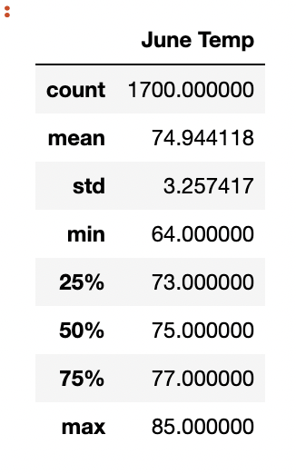
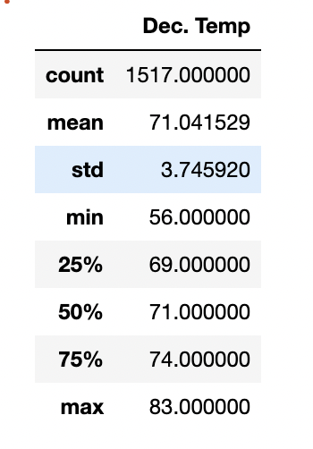

# Surfs Up - John Morrissey 

## Overview 
This analysis was preformed in order to get a better idea on whether to open a surf shop in a particular location. Weather data was downloaded and analyzed into order to give potential investors a better idea on how profitable opening a shop my be. We are looking at weather data in December and June specifically.

## Results 

-The above data collected shows that temperatures in June and December are similar. December temps are on average 4 degrees cooler, but are still well within the range for surfing.
- Minimum temperatures is significantly lower for December, but the quintile ranges are similar to the average difference of 4 degrees. 
- Max temp is similar for both months. 

## Summary 
Based off the data analyzed, both June and December are ideal months for surfing. Another measure which should be analyzed is rainfall as it is likely that people will choose not to surf when it is raining. I think a look at hotel vacancy rates would be another indication on expectations of foot traffic throughout the year. 